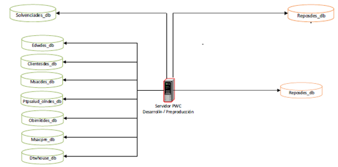
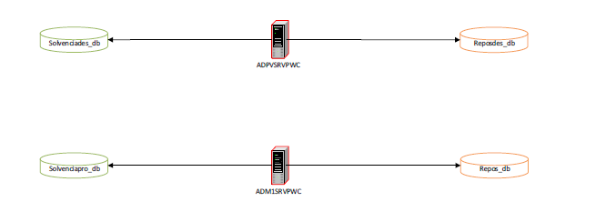
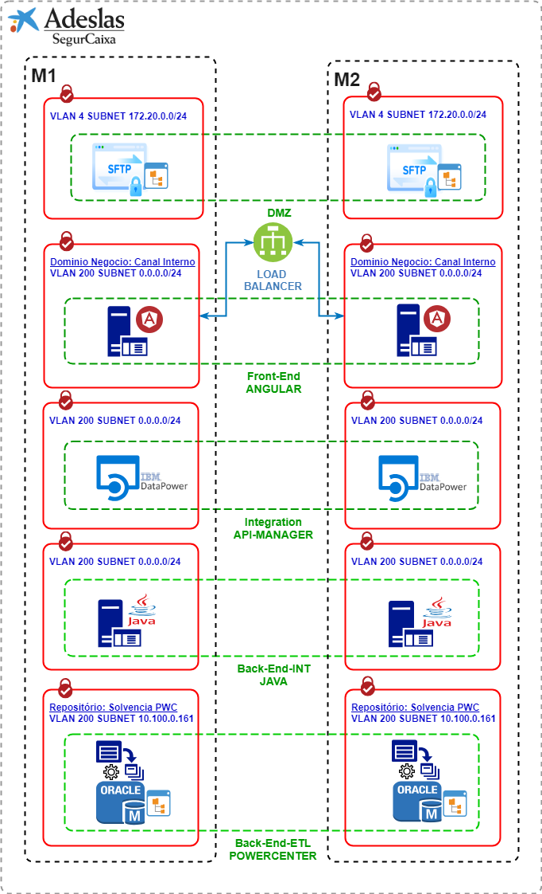
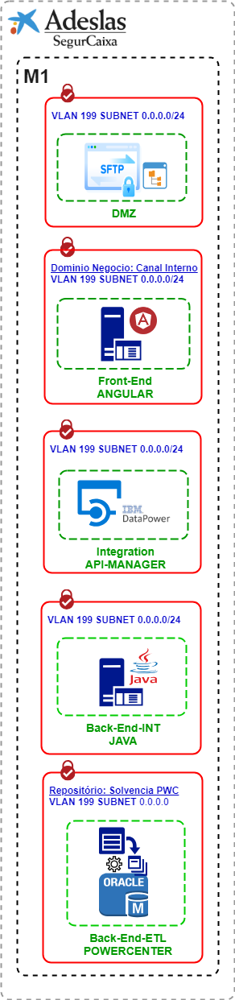

# Diseño de Infraestructura - NUEVO FICHERO DEL CONSORCIO

## 1. Descripción
El diseño resulta de implementar una infraestrucutura estandariada para dar cabida al modelo de comunicacion de datos solicitado por enm CONSORCIO de compensación de Seguros

La infraestrucura da soporte a dos entornos:

  1.- PreProduccion.
  2.- Produccion.

El diseño mapea para **PreProduccion** un sistema simple sin **HA** ni **DRS**. Adicionalmente para el entorno de **Produccion** si se diseña un sistema de **DRS** .

## 2. Diseño de bajo nivel:

### 2.1. PreProduccion

#### 2.1.1 Capa SFTP - PreProduccion

El servicio de SFTP no se implementa nuevo sino como una nueva url en el servidor de SFTP de desarrollo corporativo en el cual se configurará una nueva URL **ficheroconsorcio.xxxxx.sca.net** y que apuntará a un directorio con una capacidad de **10 Gigabytes**

Creación de la estructura de file-system:
1) Carpeta: ficheroconsorcio/in
2) Carpeta: ficheroconsorcio/out
3) Carpeta: ficheroconsorcio/error

#### 2.1.2 Capa Front-End Angular - PreProduccion

La aplicación Angular será desplegada en el pool de servidores que pertenece al  dominio de negocio **Canal Interno**.
Hay que validar la disponibilidad de recursos de HW para el desplegue de la aplicacion en el dominio de negocio solicitado (equipo Explotación/ADS).

En el caso de la necessidad de la creación de un nuevo servidor para desplegue Angular:

- Servidor en **VLAN 199** de las siguientes Caracteristicas:

|Servidor |Virt/Phys| OS | CPU | RAM | OS Storage - Type| Other Storage - Type|IP|
|---|:---:|:---:|:---:|:---:|:---:|:---:|:---:|
|**PRE-ANGULAR-SRV1-Name** | VIRT |RHEL 7 | 2 | 4 GB | N/A - N/A | **10 Gb - NAS** | **ficheroconsorcio.cert.sca.corp** 10.98.3.1 **ficheroconsorcio.int.sca.corp**  10.98.1.242 |

#### 2.1.3 Capa BackEnd Java - PreProduccion

Para la capa de integración Java se provisionará un servidor en **VLAN 199** de las siguientes Caracteristicas:

|Servidor |Virt/Phys| OS | CPU | RAM | OS Storage - Type| Other Storage - Type| IP|
|---|:---:|:---:|:---:|:---:|:---:|:---:|:---:|
|**pretcbe1con001** | VIRT |RHEL 7 | 2 | 4 GB | N/A - N/A | **10 Gb - NAS** | **ficheroconsorciobe.cert.sca.corp** pretcbe1con001 10.98.1.64 |

#### 2.1.4 Capa POWERCENTER - PreProduccion

aL Igual que en el caso anterior el servicio de ETL - PowerCenter no se implementa nuevo sino como un nuevo proceso en el servidor de PowerCenter de desarrollo corporativo que deberoa incrementar su capacidad en **50 Gigabytes** para la creación del repositório.

#### 2.1.5 Capa  BBDD - PreProduccion

Para la capa de BBDD es necesario 50GB de espacio y será utilizado la estructura de SOLVENCIA que hay actualmente en PowerCenter.

**RAMA SOLVENCIA:**

Servidor DESA/PRE ADPVSRVPWC (IP 10.98.0.8) ) 2 CORES En este caso no se usa pre, solo hay un repositorio de desarrollo.

  

### 3. PRODUCCIÓN

#### 3.1.1 Capa SFTP - Produccion

El servicio de SFTP no se implementa nuevo sino como una nueva url en el servidor de SFTP de PRODUCCIÓN corporativo en el cual se configurará una nueva URL **ficheroconsorcio.xxxxx.sca.net** y que apuntará a un directorio con una capacidad de **10 Gigabytes**

Creación de la estructura de file-system:
1) Carpeta: ficheroconsorcio/in
2) Carpeta: ficheroconsorcio/out
3) Carpeta: ficheroconsorcio/error

En este nuevo punto de acceso se configurará una conexion para Consorcio segun requerimientos.

#### 3.1.2 Capa Front-End Angular - Produccion

La aplicación Angular será desplegada en el pool de servidores que pertenece al  dominio de negocio **Canal Interno**.
Hay que validar la disponibilidad de recursos de HW para el desplegue de la aplicacion en el dominio de negocio solicitado (equipo Explotación/ADS).

En el caso de la necessidad de la creación de un nuevo servidor para desplegue Angular:

#### Caracteristicas técnicas de los servidores

1. Servidores que proveeran de **DR** a través de un balanceo NetScaler

2. Acceso al servicio en **Nombre de servicio** configurando un failover de **PRO-ANGULAR-SRV1-Nombre** activo en **M2** sobre **PRO-ANGULAR-SRV2-Nombre** activo en **M1**

3. Servidor en la **VLAN 200**

|Servidor |Virt/Phys| OS | CPU | RAM | OS Storage - Type| Other Storage - Type| DC | IP | URL|
|---|:---:|:---:|:---:|:---:|:---:|:---:|:---:|:---:|:---:|
|**PROM2FE1CIN001** | VIRT |RHEL 7 | 4 | 8 GB | N/A - N/A | 10 Gb - NAS(1) | **M2** | 10.100.5.104 | **ficheroconsorcio.sca.corp** |
|**PROM2FE1CIN002** | VIRT |RHEL 7 | 4 | 8 GB | N/A - N/A | 10 Gb - NAS(1) | **M1** | 10.100.5.104 | **ficheroconsorcio.sca.corp** |
|**PROM1FE1CIN003** | VIRT |RHEL 7 | 4 | 8 GB | N/A - N/A | 10 Gb - NAS(1) | **M1** | 10.100.5.104 | **ficheroconsorcio.sca.corp** |
|**PROM1FE1CIN004** | VIRT |RHEL 7 | 4 | 8 GB | N/A - N/A | 10 Gb - NAS(1) | **M1** | 10.100.5.104 | **ficheroconsorcio.sca.corp** |

(1) Este es un volumen de DR por lo que debe estar replicado desde **M2** hacia **M1** para dar soporte al servicio en caso de DR.

#### 3.1.4 Capa BackEnd Java - Produccion

Para la capa de integración Java se provisionará dos servidor en **VLAN 200** de las siguientes Caracteristicas:

1. Servidores que proveeran de **DR** a través de un balanceo NetScaler

2. Acceso al servicio en **Nombre de servicio** configurando un failover de **PRO-JAVA-SRV1-Nombre** activo en **M2** sobre **PRO-JAVA-SRV2-Nombre** activo en **M1**

3. Servidor en la **VLAN 200**

#### Caracteristicas técnicas de los servidores

|Servidor |Virt/Phys| OS | CPU | RAM | OS Storage - Type| Other Storage - Type| DC | IP| URL |
|---|:---:|:---:|:---:|:---:|:---:|:---:|:---:|:---:|:---:|
|**PROM2BE1CIN001 - 10.100.5.68** | VIRT |RHEL 7 | 4 | 8 GB | N/A - N/A | 10 Gb - NAS(1) | **M2** |  10.100.5.68| **ficheroconsorciobe.sca.corp**|
|**PROM1BE1CIN002 - 10.100.5.69** | VIRT |RHEL 7 | 4 | 8 GB | N/A - N/A | 10 Gb - NAS(1) | **M1** |  10.100.5.69| **ficheroconsorciobe.sca.corp** |

(1) Este es un volumen de DR por lo que debe estar replicado desde **M2** hacia **M1** para dar soporte al servicio en caso de DR.

#### 3.1.2 Capa POWERCENTER - Produccion

aL Igual que en el caso anterior el servicio de ETL - PowerCenter no se implementa nuevo sino como un nuevo proceso en el servidor de PowerCenter de PRODUCCIÓN corporativo que deberoa incrementar su capacidad en **50 Gigabytes**

#### 3.1.4 Capa  BBDD - Produccion

Para la capa de BBDD es necesario 50GB de espacio y será utilizado la estructura del repositório **SOLVENCIA**, que hay actualmente en PowerCenter.

**RAMA SOLVENCIA:**

Servidor PRO ADM1SRVPWC (IP 10.100.0.161) 8 CORES

  

### 5 Puntos de Montaje

##### Instalación Microservicio.JAR

Directorio: /var/opt/app/java/microservice

##### Instalación Certificado .JKS

Directorio: /home/consorciofichero_jenkins/scripts
Fichero: truststore_sca_cert.jks (INT / CERT)
Fichero: truststore_sca_prod.jks (PROD)

##### Usuario Local Servidor
User: consorciofichero_jenkins
Password: consorciofichero2019

##### Script Ejeción Stop / Start

(1) Directorio de ejecución del script:
Directorio: /home/consorciofichero_jenkins/scripts

(2) Ejecutar en line de comando el script <stop>:
./fichero-consorcio-main.sh stop

(3) Ejecutar en linea de comando el script <start>:
./fichero-consorcio-main.sh start

(4) Verificar el proceso linux - java:
ps -ef | grep consorcio-microservice-sca-0.0.1-SNAPSHOT.jar

##### Despliegue .JAR para PROD

(1) Ejecutar el Jenkins build entorno PRE

(2) Acceder al entorno de INT: pretcbe1con001

(3) Acceder a la carpeta donde el .JAR está instalado:
Directorio: /var/opt/app/java/microservice

(4) Copiar el .JAR para el servidor de PROD:

scp consorcio-microservice-sca-0.0.1-SNAPSHOT.jar consorciofichero_jenkins@10.100.5.68:/var/opt/app/java/microservice

scp consorcio-microservice-sca-0.0.1-SNAPSHOT.jar consorciofichero_jenkins@10.100.5.69:/var/opt/app/java/microservice

(5) Acceder SERV01 - 10.100.5.68 ejecutar script STOP/START

(6) Acceder SERV02 - 10.100.5.69 ejecutar script STOP/START

### 4 Diseño LL

**PRODDUCION:**

  

**PREPRODDUCION:**

 