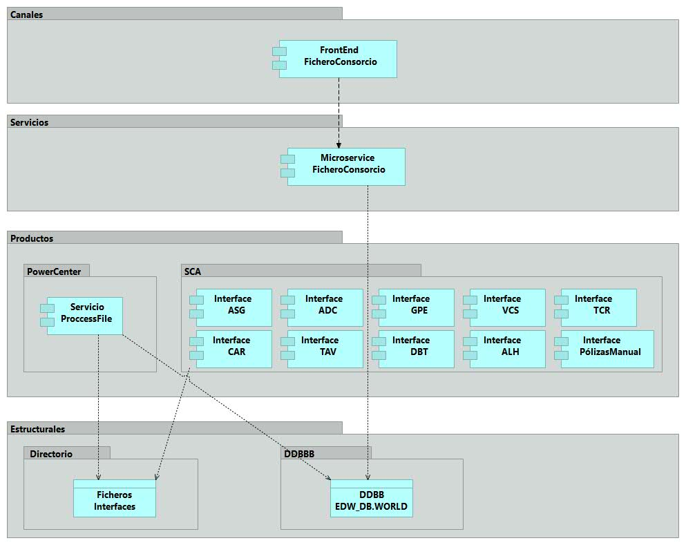
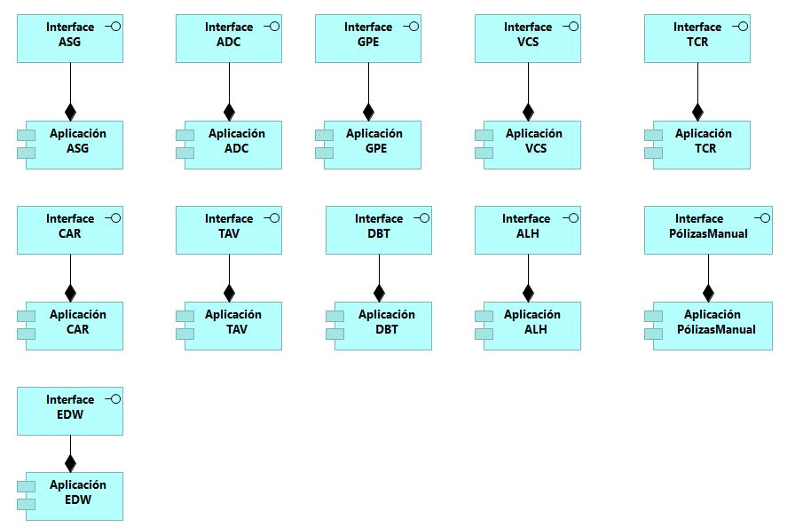
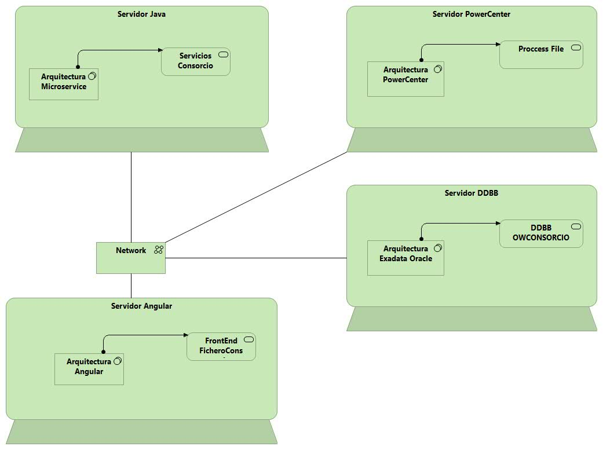

## Introducción

### Propósito general de la aplicación

El objetivo del proyecto es implantar un proceso automatizado para la generación mensualmente  de un fichero que contiene pólizas, movimientos y recibos. 
El fichero se enviará para el Consorcio de Compensación de Seguros mensualmente y el plazo de presentación de los recargos será dentro de los veinte primeros días del mes siguiente del periodo de liquidación.

### Mapa de aplicaciones

### Modelo de Entidades

## Arquitectura de Referencia

El proyecto está basado en 4 arquitecturas de referencias:

  * **Arquitectura PowerCenter**: Arquitectura Integración Datos (Ficheros / DDBB)

  * **Arquitectura Angular**: Arquitectura Web FrontEnd

  * **Arquitectura Java**: Arquitectura Microservice BackEnd

  * **Arquitectura Oracle**: Arquitectura Datos DDBB 

**************************************

#### Aplicación Web Consorcio:

  * **Descripción**: Aplicación Angular FrontEnd para gestionar los datos contenidos en los ficheros
  * **Tecnología**: Angular 2 (Arquitectura SCA)
  * **Relaciones**: Microservicio Java

* **Entornos:**
  * **URL INT**: DNS INTTCFE1ARQ001 : ficheroconsorcio.int.sca.corp 
  * **URL PRE**: DNS 10.98.3.1 : ficheroconsorcio.cert.sca.corp 
  * **URL PRO**: DNS 10.100.5.104 : ficheroconsorcio.sca.corp

**************************************

#### Componente Microservice Consorcio

  * **Descripción**: Componente de microservicio Java que contiene las reglas de negocio para gestionar las transacciones DDBB.
  * **Tecnología**: Java 8 (Arquitectura Spring Microservice)
  * **Relaciones**: Oracle-DDBB

* **Entornos:**
  * **URL PRE**: DNS pretcbe1con001 10.98.1.64 : ficheroconsorciobe.cert.sca.corp
  * **URL PRO**: DNS PROM2BE1CIN001 : ficheroconsorciobe.sca.corp VIP (10.100.7.23)
  * **URL PRO**: DNS PROM1BE1CIN002 : ficheroconsorciobe.sca.corp VIP (10.100.7.23)

**************************************
#### Componente PowerCenter

  * **Descripción**: Componente técnico desarollado en la arquietcturaPWC para apoyar todo el ciclo de vida de integración de datos (Fichero -> DDBB).
  * **Tecnología**: PowerCenter
  * **Relaciones**: Oracle-DDBB / 

* **Entornos:**
  * **URL PRE**: DESA/PRE ADPVSRVPWC (IP 10.98.0.8)
  * **URL PRO**: PRO ADM1SRVPWC (IP 10.100.0.161)

**************************************

#### DDBB Consorcio

  * **Descripción**: Persistencia de los datos en Oracle
  * **Tecnología**: Oracle 12C Exadata

* **Entornos:**
  * **URL PRE**: exam1cc3-scan.grupoadeslas.2k3:1521/SRVMKT01D
  * **Database PRE**:
  * **Schema PRE**: OWCONSORCIO
  * **User PRE**: DSCONSORCIO
  * **URL PROD**: rac21-scan.GrupoAdeslas.2k3:1521/EDW_DB.WORLD
  * **Database PROD**: EDWPROD
  * **Schema PROD**: OWCONSORCIO
  * **User PROD**: trconsorcio

**************************************

### Diagrama tecnológico

### Modelo de seguridad

**Para esta aplicación se definen 4 requerimentos de seguridad:**

(1) Comunicación segura entre los entornos SSL certificado formato SHA256

(2) Protocolo/SFTP seguro para intercambio de archivos con la entidad Consorcio

(3) Trazas de auditoria del frontEnd y BackEnd (acceso de usuarios externos y manipulación de los dados operaciones CRUD)

(4) Autenticacion basada en token OAuth
