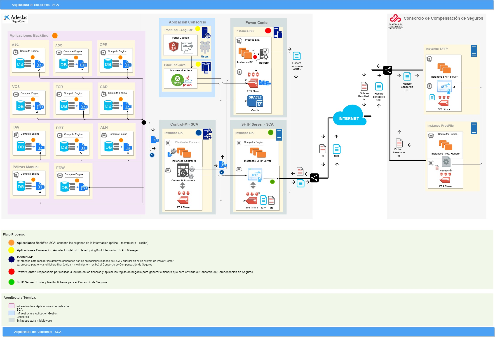
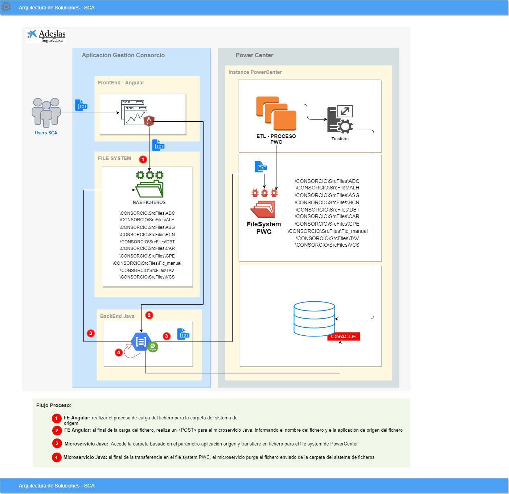

# Modelo de Solución 

## Arquitectura Técnica de Solución
El objetivo del proyecto es implantar un proceso automatizado para la generación mensualmente  de un fichero que contiene pólizas, movimientos y recibos. 
El fichero se enviará para el Consorcio de Compensación de Seguros mensualmente y el plazo de presentación de los recargos será dentro de los veinte primeros días del mes siguiente del periodo de liquidación.

La solución técnica definida para cumplir con los requisitos es la implementación de una interface de ETL en la arquitectura Power Center y la criación de una aplicación Front-End en la arquitectura Angular - SCA. Está aplicacion front-end tendrá la responsabilidad de gerenciar las reglas de negocio para la generación del fichero, monitorizar el proceso de criación/envió del fichero y en el caso que dicho aplicativo genere algún tipo de indicen encía o detecte cualquier error en fechas o contenido, se tendrá que poder modificar los errores y volver a cargar y enviar la información
Todo el proceso de obtener los dados de las aplicaciones legadas será orquestado por la herramienta Control-M y el envío se realizará en el servidor SFTP corporativo.

#### Componentes:

La seguiente lista presenta los componentes técnicos implicados en la arquitectura del proyecto:

**Aplicaciones SCA BackEnd:**
- Descripción: Aplicaciones propietaria de los dados informacionales.
- Aplicaciones:
	1. ASG
	2. ADC
	3. GPE
	4. VCS
	5. TCR
	6. CAR
	7. TAV
	8. DBT
	9. ALH
	10. Pólizas Manual

**Aplicación Gestion FrontEnd:**
- Descripción: aplicación frontEnd para realizar la gestión de las regras y monitorización del proceso.
- Arquitectura: aplicación Web - Angular 2 (Web SCA)
- Dependencias Técnicas: API que expone los métodos para gestión de los dados.

**Microservice Java:**
- Descripción: Microservice Java para integración con la estructura de dados.
- Arquitectura: Java Microservice SpringBoot (Arquetipo SCA Java).
- Dependencias Técnicas: Base de Dados Oracle (reglas de negocio / datos normalizados).

**Proceso Batch:**
- Descripción: proceso programado para orquestar la generación/envio de los ficheros
- Arquitectura: Java / Planificador Control-M
- Dependencias Técnica: aplicaciones legadas y interface ETL.

**Interface ETL:**
- Descripción: interface core para extracción de los dados (fichero), transformación de los dados aplicando las reglas de negocio y load de las informaciones en un fichero final para envió al consorcio.
- Arquitectura: Power Center
- Dependencias Técnica: ND

**Transferencia Fichero:**
- Descripción: utilización de SFTP corporativo SCA
- Arquitectura: SFTP protocolo
- Dependencias Técnica: ND

**Base de Dados:**
- Descripción: Instancias de dados Oracle para almacenar los dados extraídos y normalizado de los ficheros generados pelas aplicaciones backend. 
- Arquitectura: Oracle
- Dependencias Técnica: Utilización esquema Oracle repositorio SOLVENCIA  

#### Conectividad Red:

| .#. | Entorno Origen | Entorno Destino | Comunicación |
| - | - | - | - |
| 1 | PortalAngular  | APIManager | 443/TCP |
| 2 | JavaMicroservice | Oracle-DDBB  | 1521/TCP |
| 3 | Power Center | Base Oracle  | 1521/TCP |
| 4 | SFTPCorp | ConsorcioSeg  | 1110/TCP |

## Diagrama de alto nivel

**Diagrama: Arquitectura General**

[Enlace de descarga del diagrama para importar en Draw.io](./images/arqSolucion01.xml)

**Diagrama: Caso de Uso Carga de Fichero**

[Enlace de descarga del diagrama para importar en Draw.io](./images/sistemaFicheroConsorcio.drawio)

## Tareas identificadas en el proyecto

De estos procesos se deriva una lista de acciones que se divide de la siguiente manera:

| .#. | Tarea | Descripción | Responsable |
| - | - | - | - |
| 1 | Modelo de solución | Realización de este documento | Arquitectura |
| 2 | Diseño técnico | Realización del diseño técnico en formato MarkDown | Arquitectura |
| 3 | Diseño de infraestructura | Realización del diseño de infraestructura a alto y bajo nivel de todos los entornos | Arquitectura |
